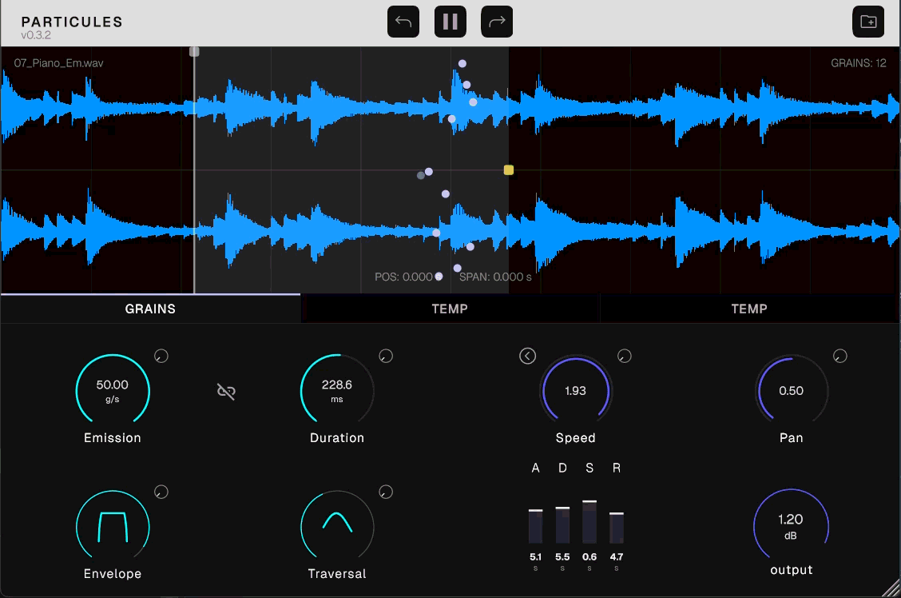

# Particules - Granular Synthesizer

Particules is a real-time granular synthesizer built with JUCE.

It transforms an audio input into a stream of grains with deterministic or stochastic control over temporal density, buffer position, and playback rate.

---

## Overview



The instrument is designed around a simple set of parameters:

- **position**: read pointer location in the source buffer
- **span**: width of the region around the read position
- **emission**: grain spawning rate (grains per second)
- **duration**: grain length in seconds
- **envelope**: amplitude window applied per grain
- **speed**: playback rate (affects pitch and time)

This allow creation of:
- time-varying granular clouds
- time-stretching and micro-looping artifacts

Keep in mind that the result is highly dependent on the input signal.

## Visualization
The visualizer provides real-time feedback on the grain cloud using the following logic:

X-axis: Represents the grain's position in time within the audio buffer.
Y-axis: Stochastic vertical offset randomized at spawn to visualize density and prevent overlap.
Opacity: Reflects the grain's current envelope amplitude (fade-in and fade-out).  

---

## Capabilities

- drag and drop an audio file to load it in the synth
- Control over the density of the grains cloud (emission and duration)
- Position and span control over the audio source
- Playback and speed control
- Per-grain envelope shaping
Deterministic or stochastic behavior (jitter WIP)

The engine supports continuous parameter modulation during playback, enabling smooth transitions between textures without audio interruption.


---

## Architecture

The system separates audio processing and interface into two independent components communicating asynchronously:

- **UI -> DSP** (per audio block)  
  - parameter changes are captured and applied in the audio engine  
  - loading an audio file prepares the engine for playback  

- **DSP -> UI** (30 Hz)  
  - runtime data such as active grain positions are exposed for visualization  

Communication is implemented using non-blocking mechanisms to preserve real-time audio constraints and avoid interference with the audio thread.

The audio engine is responsible for sound generation, while the interface handles interaction and visualization.


---

## Design Focus

Particules emphasizes:

real-time safe parameter modulation
minimal and orthogonal control set
clear mapping between UI and DSP behavior
low-latency response to parameter changes
visual feedback of grain distribution


----

### Supported Formats

Plugin formats: Standalone, VST3, AU, CLAP
Audio file formats: depend on JUCE configuration (typically WAV, AIFF, optionally MP3)


----

## Build

### Requirements
- CMake >= 3.25
- C++17 compatible compiler (**C++20 recommended**)
- JUCE (included as submodule)


### Linux Dependencies
Before building on Linux, you must install the following system dependencies (package names for Ubuntu/Debian):

```bash
sudo apt-get update && sudo apt-get install -y \
    pkg-config \
    libasound2-dev libx11-dev libxinerama-dev libxext-dev \
    libfreetype6-dev libwebkit2gtk-4.0-dev libglu1-mesa-dev \
    libjack-jackd2-dev libcurl4-openssl-dev libxcomposite-dev \
    libxcursor-dev libxrandr-dev libxrender-dev mesa-common-dev \
    libgtk-3-dev xvfb ninja-build
```

### Build steps

```bash
git clone --recurse-submodules <repo-url>
cd Particules
cmake -B build
cmake --build build --target Particules
```

Note: The Particules target automatically builds all formats defined in the CMake configuration.


---

### Planned Improvements

- Midi input compatibility (8 or 16 voices max)
- Stereo panning control
- Multiple regions selection/exclusion
- Improved waveform navigation (zoom)
- Modulator visual indicators around knobs
- ADSR implementation for each voices
- Undo manager
- One shot playback mode

---

## License

- This project is licensed under the GNU General Public License v3.0 (GPLv3)
- You are free to copy, distribute, and modify the software
- Any modifications must also be licensed under the GPL
- Software is provided "as is" without warranty